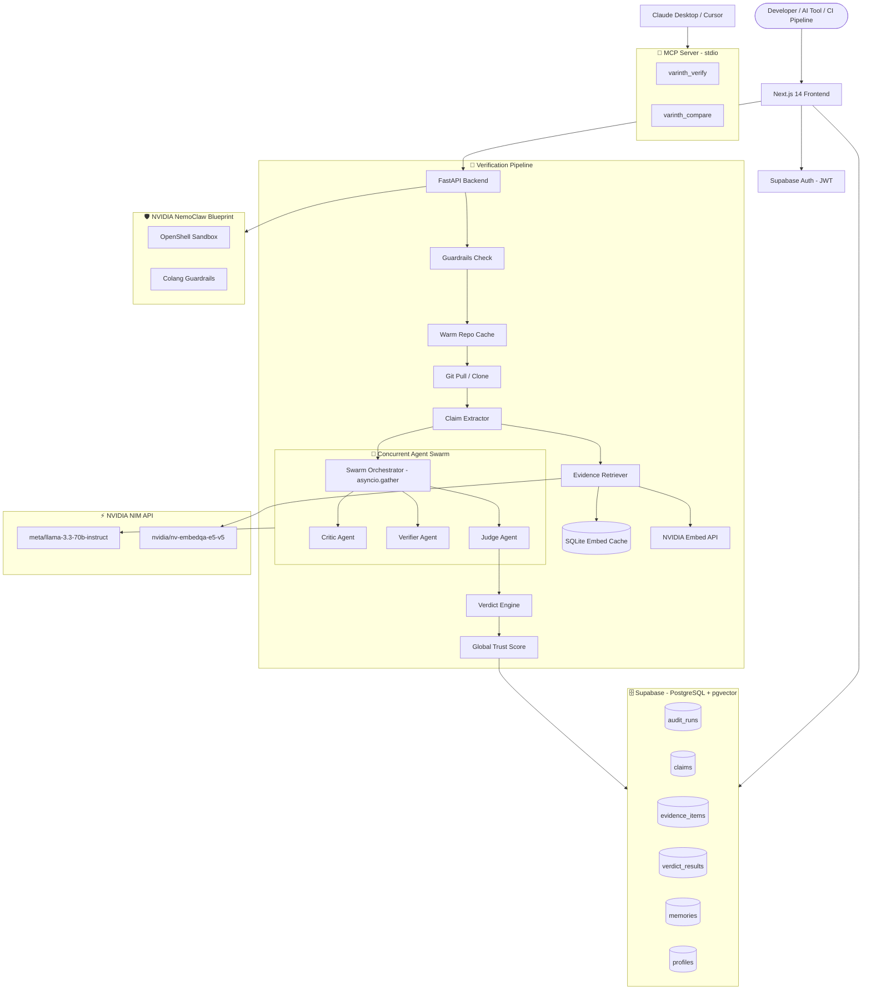

<div align="center">


# Varinth

### 🛡️ Every AI-generated claim. Verified. Against your actual code. With proof.

<p align="center">
  Varinth transforms unverified AI-generated answers into fully auditable Proof Objects — running a concurrent three-agent swarm (Critic, Verifier, Judge) against your real codebase to confirm or contradict every claim with exact file paths and line numbers.
</p>

<br/>

<p align="center">
  
  
  
  
  
  
  
  
</p>

<p align="center">
  <a href="#-why-varinth">Why Varinth</a> •
  <a href="#-features">Features</a> •
  <a href="#-architecture">Architecture</a> •
  <a href="#%EF%B8%8F-the-verification-swarm">The Swarm</a> •
  <a href="#-use-case-diagram">Use Cases</a> •
  <a href="#-local-setup">Setup</a> •
  <a href="#-database-schema">Database</a>
</p>

</div>

---

## 💡 Why Varinth?

AI tools generate code explanations, architecture summaries, and technical claims constantly. But they hallucinate. They describe functions that don't exist. They cite the wrong line numbers. They claim a feature is implemented when it isn't.

**Varinth solves the trust layer that every AI-assisted engineering workflow is missing.**

Instead of asking _"Does this sound right?"_, Varinth asks _"Can this be proven from the code?"_

- 🔍 **Claim extraction** — decomposes any AI answer into atomic, verifiable statements
- 📡 **Semantic retrieval** — finds the most relevant codebase evidence using NVIDIA embedding models
- 🤖 **Concurrent agent swarm** — three specialized AI agents debate each claim in parallel
- 📋 **Proof Object output** — a fully auditable report with file paths, line numbers, trust scores, and grounded corrections

This project was built with a **proof-first engineering philosophy**:

- ⚡ Real LLM reasoning — no heuristics, no keyword matching shortcuts
- 🏗️ Multi-agent pipeline with structured Pydantic output enforcement and self-repair loops
- 📊 Supabase persistence for every audit run, claim, evidence item, and verdict
- 🎨 Premium dark-mode glassmorphism SaaS dashboard with animated audit visualizations
- 🔐 JWT auth, path traversal protection, rate limiting, and NVIDIA NemoClaw sandbox policies

---

## ✨ Features

### 🤖 Three-Agent Verification Swarm
- **Critic Agent** — identifies logical gaps, naming mismatches, and structural contradictions between claims and codebase evidence
- **Verifier Agent** — evaluates each retrieved snippet individually, flagging `supports_claim` or `contradicts_claim` with reasoning
- **Judge Agent** — synthesizes all evidence into a final verdict and generates a **Grounded Correction Block** (with corrected statement, file path, and line range) whenever a claim is contradicted
- All three agents run **concurrently** via `asyncio.gather` — **~3 second** total swarm time (down from 45+ seconds in V1)

### 🔍 Two-Stage Evidence Retrieval
- **Stage 1 (Keyword Scan)**: Extracts keyphrases, walks the repository file tree, filters by allowed extension whitelist, and extracts surrounding code context
- **Stage 2 (Semantic Re-ranking)**: Generates NVIDIA embeddings for both snippets and the claim, scores cosine similarity, and re-ranks evidence by relevance
- **SQLite Embedding Cache**: Content-addressed cache (`SHA256` keyed) skips NVIDIA API calls entirely for unchanged files — zero latency on repeat audits

### 📝 Question-Only Mode
- Submit a question with **no pre-written answer**
- Varinth retrieves context, drafts a grounded LLM response, saves it to the database, and runs the full swarm against its own output
- Transforms from a verification tool into an **exploratory codebase intelligence engine**

### 🔄 Pydantic Self-Repair Loop
- If an LLM agent returns malformed JSON, the client intercepts the `ValidationError`, formats a correction prompt with the full validation trace and schema, and requests a repaired payload
- Zero audit crashes from LLM formatting failures

### ⚡ Warm Repository Cache
- Repositories cloned to `backend/temp_clone/` on first run
- Subsequent audits execute `git reset --hard` + `git pull` (delta fetch only)
- Eliminates 5–20s clone latency on repeat runs against the same repository

### 📡 MCP Native Integration
- Run Varinth directly inside **Claude Desktop** or **Cursor Composer** via the Model Context Protocol
- `varinth_verify` — audit any AI-generated answer against a local or remote codebase
- `varinth_compare` — compare two AI answers head-to-head with side-by-side trust scores and verdict breakdowns

### 🛡️ Enterprise Security
- **NVIDIA NemoClaw / OpenClaw**: Sandboxed filesystem access with `openclaw-sandbox.yaml` — network whitelisted exclusively to NVIDIA and Supabase endpoints
- **Colang Guardrails** (`nemoclaw/rails.co`): Prompt injection blocking and off-topic request rejection
- **Path Traversal Protection**: Every filesystem operation validated via `os.path.realpath` canonicalization
- **JWT Auth**: Every API route protected via Supabase session token verification
- **Rate Limiting**: 10 requests/minute per user enforced in-memory before LLM calls

---

## 🏗 Architecture



---

## ⚙️ The Verification Swarm

The pipeline runs in four stages per audit:

### Stage 1 — Guardrails & Repository Setup
| Step | What happens |
|---|---|
| Input Validation | Guardrails checks for prompt injection patterns and forbidden path segments |
| Warm Cache | Checks `backend/temp_clone/<repo>` — pulls delta changes if exists, clones fresh if not |
| Path Security | `assert_path_in_scope` canonicalizes all paths via `os.path.realpath` to block directory escape |

### Stage 2 — Claim Extraction
The **Claim Extractor** receives the user's answer and decomposes it into standalone, atomic, verifiable sentences — each tagged with `claim_type` (behavioral / structural / dependency) and `importance` (critical / standard / minor).

**Model**: `meta/llama-3.3-70b-instruct` via NVIDIA NIM  
**Output**: Pydantic-validated `ClaimSet` — self-repaired if malformed

### Stage 3 — Semantic Evidence Retrieval
Two-stage retrieval per claim:

| Stage | Method | Details |
|---|---|---|
| Keyword Scan | Walk repo tree | Filters by extension whitelist, extracts 30-line context windows |
| Semantic Re-ranking | Cosine similarity | NVIDIA `nv-embedqa-e5-v5` embeddings, SQLite cache for unchanged files |

- SQLite cache keyed by `SHA256(content)` — zero API calls for files unchanged between runs

### Stage 4 — Concurrent Agent Swarm (~3 seconds total)
Three agents run simultaneously against each claim's evidence:

| Agent | Model | Role |
|---|---|---|
| Critic | 70B | Identifies structural gaps, naming mismatches, and logic contradictions |
| Verifier | 70B | Per-snippet boolean classification: `supports_claim` / `contradicts_claim` |
| Judge | 70B | Final verdict synthesis + Grounded Correction Block generation |

**Verdict Engine** then computes the final verdict per claim:
- `supported` — requires `relevance ≥ 0.5` AND `supports_claim = True` (neutral snippets cannot trigger supported)
- `contradicted` — requires `relevance ≥ 0.3` AND `contradicts_claim = True`
- `unverified` — all other cases

---

## 📊 Use Case Diagram

```
┌──────────────────────────────────────────────────────────────┐
│                  VARINTH VERIFICATION SYSTEM                 │
│                                                              │
│  ╔════════════════╗    ╔═══════════════════════════════════╗ │
│  ║ ACTOR          ║    ║ USE CASES                         ║ │
│  ╠════════════════╣    ╠═══════════════════════════════════╣ │
│  ║ Developer      ║───▶║ [UC1] Submit Answer for Audit     ║ │
│  ║                ║    ║ [UC2] Browse Audit History        ║ │
│  ║                ║    ║ [UC3] Register Git Repository     ║ │
│  ║                ║    ║ [UC4] Use Question-Only Mode      ║ │
│  ╠════════════════╣    ╠═══════════════════════════════════╣ │
│  ║ AI Tool        ║───▶║ [UC5] varinth_verify via MCP      ║ │
│  ║ (Claude/Cursor)║    ║ [UC6] varinth_compare via MCP     ║ │
│  ╠════════════════╣    ╠═══════════════════════════════════╣ │
│  ║ CI/CD Pipeline ║───▶║ [UC7] REST API Audit Call         ║ │
│  ╚════════════════╝    ╠═══════════════════════════════════╣ │
│                        ║ INTERNAL PIPELINE                  ║ │
│                        ║  1. Extract Claims                 ║ │
│                        ║  2. Retrieve Semantic Evidence     ║ │
│                        ║  3. Run Concurrent Swarm           ║ │
│                        ║     ├─ Critic                      ║ │
│                        ║     ├─ Verifier                    ║ │
│                        ║     └─ Judge                       ║ │
│                        ║  4. Compute Trust Score            ║ │
│                        ║  5. Write Proof Object to DB       ║ │
│                        ╚═══════════════════════════════════╝ │
└──────────────────────────────────────────────────────────────┘
```

---

## 📂 Project Structure

```bash
varinth/
├── backend/
│   ├── app/
│   │   ├── main.py                     # FastAPI app + CORS + error handlers
│   │   ├── api/
│   │   │   └── audits.py               # POST /api/v1/audits, GET history + single run
│   │   ├── core/
│   │   │   ├── config.py               # Settings (NVIDIA, Supabase, NemoClaw toggles)
│   │   │   ├── security.py             # JWT verification, path scope checks, extension whitelist
│   │   │   ├── rate_limiter.py         # In-memory token bucket (10 req/min per user)
│   │   │   └── logging.py              # Structured JSON logging
│   │   ├── models/
│   │   │   └── schemas.py              # Pydantic schemas for all API requests and responses
│   │   └── services/
│   │       ├── orchestrator.py         # Main pipeline coordinator — warm cache, Q-only mode, DB writes
│   │       ├── claim_extractor.py      # LLM-based atomic claim decomposition
│   │       ├── retriever.py            # Keyword scan + NVIDIA semantic re-ranking + SQLite cache
│   │       ├── llm_client.py           # NVIDIA NIM + NemoClaw client with Pydantic repair loop
│   │       ├── verdict_engine.py       # Trust score computation and verdict classification
│   │       ├── guardrails.py           # Input security checks (injection, path scopes)
│   │       ├── memory.py               # pgvector long-term semantic memory
│   │       ├── graph.py                # Codebase relationship graph builder
│   │       └── agents/
│   │           ├── critic.py           # Critic agent — gap and mismatch detection
│   │           ├── verifier.py         # Verifier agent — per-snippet boolean classification
│   │           ├── judge.py            # Judge agent — verdict synthesis + Grounded Corrections
│   │           └── swarm_orchestrator.py  # asyncio.gather concurrent swarm runner
│   ├── mcp_server.py                   # MCP stdio server (varinth_verify + varinth_compare)
│   ├── Dockerfile
│   └── tests/                          # 25 passing unit tests
│       ├── test_swarm.py
│       ├── test_swarm_v2.py
│       ├── test_verdict_engine.py
│       ├── test_security.py
│       ├── test_rate_limiter.py
│       └── test_phase2_remaining.py
│
├── frontend/
│   └── src/
│       ├── app/
│       │   ├── page.tsx                # Landing page with animated particle canvas
│       │   ├── dashboard/              # Audit submission console
│       │   ├── audits/[id]/            # Audit Proof Object report view
│       │   ├── contexts/               # Registered repository sources
│       │   ├── swarm-pipeline/         # Architecture visualization page
│       │   ├── integration-hub/        # MCP, CLI, GitHub Actions integration guides
│       │   ├── proof-spec/             # Proof Object schema specification
│       │   └── (auth)/
│       │       ├── login/              # Supabase auth login
│       │       └── signup/             # Supabase auth registration
│       ├── components/
│       │   └── Navbar.tsx              # Sticky authenticated navigation bar
│       └── public/
│           ├── logo.png                # Varinth brand logo
│           └── fonts/                  # Custom display font (Aboro)
│
├── nemoclaw/
│   ├── config.yml                      # NemoClaw model routing (main + embeddings)
│   └── rails.co                        # Colang guardrail definitions (prompt injection, off-topic)
├── openclaw.json                       # OpenClaw agent orchestration schema
├── openclaw-sandbox.yaml               # OpenShell filesystem & network access policies
├── schema.sql                          # Supabase PostgreSQL database schema
├── phase2_schema.sql                   # Embedding cache + graph table extensions
├── docker-compose.yml                  # Full-stack container orchestration
└── mcp_settings.example.json          # Claude Desktop / Cursor MCP configuration template
```

---

## 🗄 Database Schema

All tables managed via Supabase PostgreSQL.

### `audit_runs`
| Column | Type | Description |
|---|---|---|
| audit_run_id | UUID | Primary key |
| user_id | UUID | FK → Supabase auth user |
| question | Text | The question submitted for verification |
| answer | Text | The AI-generated answer being audited |
| repo_url | String | Target repository URL |
| status | String | `pending` / `running` / `completed` / `failed` |
| global_score | Float | Trust score 0.0–1.0 |
| claim_count | Integer | Number of claims extracted |
| duration_ms | Integer | Total pipeline duration |
| created_at | DateTime | Timestamp |

### `claims`
| Column | Type | Description |
|---|---|---|
| claim_id | UUID | Primary key |
| audit_run_id | UUID | FK → audit_runs |
| claim_index | Integer | Claim order position |
| raw_text | Text | The extracted claim statement |
| claim_type | String | `behavioral` / `structural` / `dependency` |
| importance | String | `critical` / `standard` / `minor` |
| verdict | String | `supported` / `contradicted` / `unverified` |
| explanation | Text | Agent reasoning summary |

### `evidence_items`
| Column | Type | Description |
|---|---|---|
| evidence_id | UUID | Primary key |
| claim_id | UUID | FK → claims |
| source_id | String | Relative file path |
| snippet | Text | Matched code context |
| location | String | Line range (e.g. `L24-L41`) |
| relevance_score | Float | Cosine similarity score |

### `verdict_results`
| Column | Type | Description |
|---|---|---|
| result_id | UUID | Primary key |
| claim_id | UUID | FK → claims |
| supports_claim | Boolean | Verifier flag |
| contradicts_claim | Boolean | Verifier flag |
| grounded_correction | Text | Judge-generated correction statement |
| correction_file | String | Cited correction file path |
| correction_lines | String | Cited line range |

### `profiles`
| Column | Type | Description |
|---|---|---|
| id | UUID | Matches Supabase `auth.users.id` |
| email | String | User email |
| username | String | Display name |
| created_at | DateTime | Registration timestamp |

---

## 🧠 Engineering Decisions

### Why a three-agent swarm instead of one LLM call?
Separation of concerns produces dramatically more accurate verdicts. The Critic excels at detecting structural gaps. The Verifier produces fine-grained per-snippet boolean classifications. The Judge synthesizes both into a final verdict with grounded correction reasoning. Running one prompt to do all three conflates concerns and produces weaker, less calibrated outputs.

### Why `asyncio.gather` for swarm concurrency?
The three swarm agents are fully independent per claim — they receive the same evidence and produce independent outputs. Running them concurrently reduces total swarm latency to the slowest single agent rather than the sum of all three. This is the primary driver behind cutting audit time from 45+ seconds to ~3 seconds.

### Why a Pydantic self-repair loop?
Open-weight LLMs (even 70B models) occasionally produce malformed JSON that doesn't match a strict schema. Rather than crashing the audit or falling back to a generic response, the repair loop feeds the exact `ValidationError` trace back to the model with the target schema attached — typically achieving valid output within one repair cycle.

### Why SQLite for embedding cache?
Cloud embedding APIs are fast but not free. For large codebases with thousands of file snippets, re-embedding unchanged content on every run is wasteful. SQLite is zero-dependency, embedded, and perfectly suited for a content-addressed lookup table keyed by `SHA256(snippet_text)`. Cache hit rate on repeat audits of the same repo is typically above 90%.

### Why warm repository cache instead of always cloning?
A cold `git clone` of a large repository (e.g. 500MB) adds 10–20 seconds to every audit run. By persisting clones to `backend/temp_clone/` and running `git reset --hard && git pull` on subsequent runs, delta fetches complete in under 1 second for most repositories.

### Why `os.path.realpath` for path security?
On Windows, `tempfile.mkdtemp()` can return short-format paths (e.g. `KUSHAL~1`) that don't match the canonical long-form path (e.g. `kushalrajgs`). Without canonicalization, prefix-matching security checks fail silently, allowing relative file paths from inside temp directories to escape scope validation. Wrapping all paths in `os.path.realpath` at creation time resolves both the Windows short-path issue and Unix symlink escape risks.

---

## 🚀 Local Setup

### Prerequisites
- Python 3.12+, Node.js 18+
- [Supabase](https://supabase.com) project (free tier works)
- [NVIDIA API Key](https://build.nvidia.com) (free tier available)

### 1. Backend

```bash
cd backend
python -m venv venv
.\venv\Scripts\activate       # Windows
# source venv/bin/activate    # Mac/Linux

pip install -r requirements.txt

cp .env.example .env
# Fill in: SUPABASE_URL, SUPABASE_SERVICE_ROLE_KEY, NVIDIA_API_KEY

# Run schema migrations in Supabase SQL editor:
# 1. schema.sql
# 2. phase2_schema.sql

uvicorn app.main:app --reload
```

### 2. Frontend

```bash
cd frontend
npm install

cp .env.local.example .env.local
# Fill in: NEXT_PUBLIC_SUPABASE_URL, NEXT_PUBLIC_SUPABASE_ANON_KEY, NEXT_PUBLIC_API_URL

npm run dev
```

### 3. Claude Desktop MCP Integration

Add to `claude_desktop_config.json`:

```json
{
  "mcpServers": {
    "varinth": {
      "command": "python",
      "args": ["-m", "app.mcp_server"],
      "cwd": "/path/to/varinth/backend",
      "env": {
        "SUPABASE_URL": "...",
        "SUPABASE_SERVICE_ROLE_KEY": "...",
        "NVIDIA_API_KEY": "nvapi-..."
      }
    }
  }
}
```

### 4. Docker Deployment

```bash
docker-compose up --build
```

### 5. NemoClaw Private GPU Mode

Set in `.env`:
```env
NEMOCLAW_ENABLED=True
NEMOCLAW_URL=http://localhost:9000/v1
NEMOCLAW_CHAT_MODEL=nvidia/nemotron-4-340b-instruct
NEMOCLAW_EMBED_MODEL=nvidia/nv-embed-qa
```

Token-bucket rate limiting is automatically bypassed in NemoClaw mode — the local GPU inference server has no external rate constraints.

---

## 🧪 Running Tests

```bash
cd backend
.\venv\Scripts\activate
pytest tests/ -v
# ======================= 25 passed ========================
```

Test coverage includes:
- Swarm agent output validation (V1 + V2)
- Verdict engine scoring logic
- Security path traversal checks
- Rate limiter enforcement
- Guardrails input checking
- Memory and graph service integration

---

## 📈 Resume Value

Varinth demonstrates full-stack ownership with real production engineering complexity:

- **Multi-agent AI swarm** with concurrent execution, Pydantic structured outputs, and self-repair loops
- **Semantic retrieval pipeline** — two-stage keyword + NVIDIA embedding-based cosine similarity re-ranking
- **MCP server** — native integration with Claude Desktop and Cursor as a first-class AI tool
- **Performance engineering** — warm git cache, SQLite embedding cache, `asyncio.gather` parallelism
- **Enterprise security** — path traversal protection, JWT auth, NVIDIA NemoClaw sandbox policies, Colang guardrails
- **Production engineering** — rate limiting, graceful partial failure recovery, structured logging, foreign key–safe DB writes
- **Premium frontend** — dark-mode glassmorphism, animated radar scan UX, claim verdict visualization sheets

---

## 🤝 Contributing

Contributions, ideas, and verification pipeline critiques are welcome.

If you're interested in agentic AI systems, structured LLM output engineering, semantic retrieval, or building trust layers for AI-generated content — this project will resonate with you.

---

## 📜 License

MIT License

---

<div align="center">

### Built with multi-agent precision. Backed by code-level proof.

**Varinth** — *Trust the code, not the claim.*

</div>
